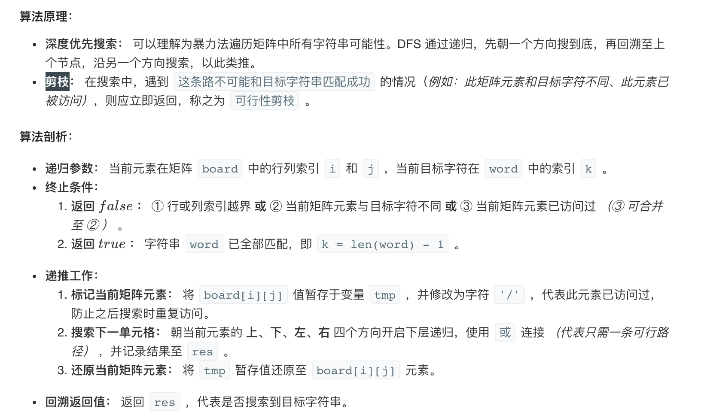

## 动态规划

动态规划（英语：Dynamic programming，简称 DP）是一种在数学、管理科学、计算机科学、经济学和生物信息学中使用的，通过把原问题分解为相对简单的子问题的方式求解复杂问题的方法。

动态规划常常适用于**有重叠子问题**和**最优子结构性质**的问题，动态规划方法所耗时间往往远少于朴素解法。

动态规划背后的基本思想非常简单。大致上，若要解一个给定问题，我们需**要解其不同部分（即子问题），再根据子问题的解以得出原问题的解**。**动态规划往往用于优化递归问题，例如斐波那契数列，如果运用递归的方式来求解会重复计算很多相同的子问题，利用动态规划的思想可以减少计算量**。

通常许多子问题非常相似，为此动态规划法试图仅仅解决每个子问题一次，**具有天然剪枝的功能**，从而减少计算量：一旦某个给定子问题的解已经算出，则将其记忆化存储，以便下次需要同一个子问题解之时直接查表。这种做法在重复子问题的数目关于输入的规模呈指数增长时特别有用。

### 1.[53. 最大子序和](https://leetcode-cn.com/problems/maximum-subarray/)

[code](1.py)

### 2.[121. 买卖股票的最佳时机](https://leetcode-cn.com/problems/best-time-to-buy-and-sell-stock/)

[code](2.py)


### 3.[198. 打家劫舍](https://leetcode-cn.com/problems/house-robber/)

[code](3.py)

### 4.[70. 爬楼梯](https://leetcode-cn.com/problems/climbing-stairs/)

[code](4.py)

### 5.[392. 判断子序列](https://leetcode-cn.com/problems/is-subsequence/)

[code](5.py)

### 6.[746. 使用最小花费爬楼梯](https://leetcode-cn.com/problems/min-cost-climbing-stairs/)

[code](6.py)

### 7.[62. 不同路径](https://leetcode-cn.com/problems/unique-paths/)

[code](7.py)
$$
dp[i][j]=dp[i-1][j]+dp[i][j-1]
$$


### 8.[63. 不同路径 II](https://leetcode-cn.com/problems/unique-paths-ii/)

[code](8.py)

```
# 存在障碍物
输入:
[
  [0,0,0],
  [0,1,0],
  [0,0,0]
]
输出: 2
解释:
3x3 网格的正中间有一个障碍物。
从左上角到右下角一共有 2 条不同的路径：

1. 向右 -> 向右 -> 向下 -> 向下
2. 向下 -> 向下 -> 向右 -> 向右
```

```python
if nums[i]==1:
	dp[i][j]=0
else:
	dp[i][j]=dp[i-1][j]+dp[i][j-1]
```


### 9.[96. 不同的二叉搜索树](https://leetcode-cn.com/problems/unique-binary-search-trees/):confused:

[code](9.py)

```
输入: 3
输出: 5
解释:
给定 n = 3, 一共有 5 种不同结构的二叉搜索树:

   1         3     3      2      1
    \       /     /      / \      \
     3     2     1      1   3      2
    /     /       \                 \
   2     1         2                 3

```

### 10.[面试题 17.16. 按摩师](https://leetcode-cn.com/problems/the-masseuse-lcci/)

[code](10.py)
$$
dp[i]=max(dp[i-2]+nums[i],dp[i-1]) \\
a,b=b,max(a+nums[i],b)
$$


### 11.[152. 乘积最大子数组](https://leetcode-cn.com/problems/maximum-product-subarray/)

[code](11.py)
$$
if nums[i]<0: swap(imax,imin)    ····(1) \\ 
imax=max(imax*nums[i],nums[i]) ····(2) \\
imin=min(imin*nums[i],nums[i])
$$


### 12.[面试题 08.01. 三步问题](https://leetcode-cn.com/problems/three-steps-problem-lcci/)

$$
dp[i]=dp[i-1]+dp[i-2]+dp[i-3]
$$


<hr>

### 13.[面试题 08.11. 硬币](https://leetcode-cn.com/problems/coin-lcci/)

[code](13.py)


### 14.[面试题12. 矩阵中的路径](https://leetcode-cn.com/problems/ju-zhen-zhong-de-lu-jing-lcof/)

[code](14.py)



- [注解](https://leetcode-cn.com/problems/ju-zhen-zhong-de-lu-jing-lcof/solution/mian-shi-ti-12-ju-zhen-zhong-de-lu-jing-shen-du-yo/)


### 15.[面试题14- I. 剪绳子](https://leetcode-cn.com/problems/jian-sheng-zi-lcof/)

[code](15.py)

- 数学公式推导
- 动态规划

### 16.[面试题 01.05. 一次编辑](https://leetcode-cn.com/problems/one-away-lcci/)

[code](16.py)

### 17.[面试题 17.06. 2出现的次数](https://leetcode-cn.com/problems/number-of-2s-in-range-lcci/):confused:


