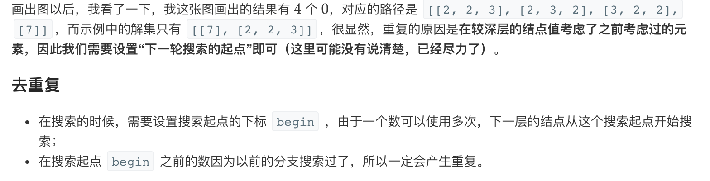

## 回溯算法

回溯算法实际上一个类似枚举的搜索尝试过程，主要是在搜索尝试过程中寻找问题的解，当发现已不满足求解条件时，就 “回溯” 返回，尝试别的路径。回溯法是一种选优搜索法，按选优条件向前搜索，以达到目标。但当探索到某一步时，发现原先选择并不优或达不到目标，就退回一步重新选择，这种走不通就退回再走的技术为回溯法，而满足回溯条件的某个状态的点称为 “回溯点”。许多复杂的，规模较大的问题都可以使用回溯法，有“通用解题方法”的美称。

回溯算法的基本思想是：从一条路往前走，能进则进，不能进则退回来，换一条路再试。


### 1.[17. 电话号码的字母组合](https://leetcode-cn.com/problems/letter-combinations-of-a-phone-number/)

[code](1.py)

### 2. [22. 括号生成](https://leetcode-cn.com/problems/generate-parentheses/)

[code](2.py)

### 3.[39. 组合总和](https://leetcode-cn.com/problems/combination-sum/):smile:




[code][3.py]

```
输入: candidates = [2,3,6,7], target = 7,
所求解集为:
[
  [7],
  [2,2,3]
]
```

```
输入: candidates = [2,3,5], target = 8,
所求解集为:
[
  [2,2,2,2],
  [2,3,3],
  [3,5]
]

```

### 4.[40. 组合总和 II](https://leetcode-cn.com/problems/combination-sum-ii/)

[code](4.py)

### 5.[46. 全排列](https://leetcode-cn.com/problems/permutations/)

[code](5.py)

### 6.[47. 全排列 II](https://leetcode-cn.com/problems/permutations-ii/)

[code](6.py)

### 7.[60. 第k个排列](https://leetcode-cn.com/problems/permutation-sequence/) :confused:

[code](7.py)

### 8.[78. 子集](https://leetcode-cn.com/problems/subsets/)


