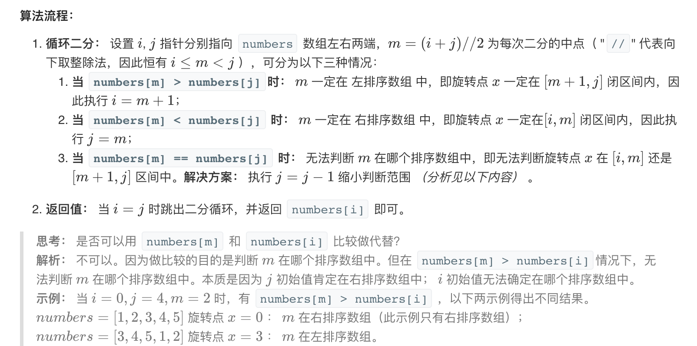
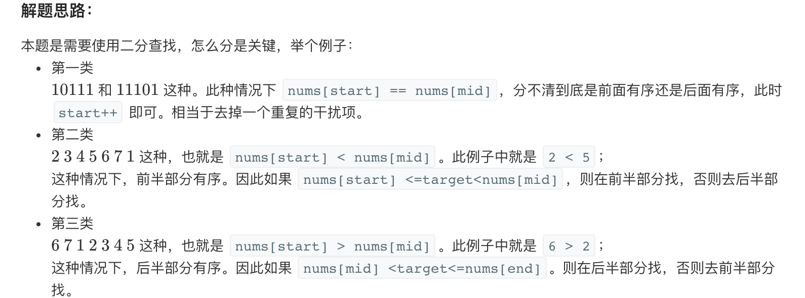
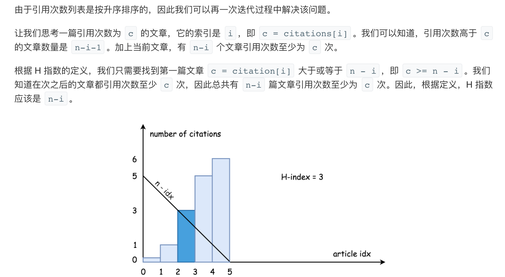

## 二分查找
二分查找也称折半查找（Binary Search），它是一种效率较高的查找方法，前提是**数据结构必须先排好序**，可以在数据规模的对数时间复杂度内完成查找。但是，**二分查找要求线性表具有有随机访问的特点（例如数组）**，也要求线性表能够根据中间元素的特点推测它两侧元素的性质，以达到缩减问题规模的效果。

- 标签：二分查找
- 如果该题目暴力解决的话需要 O(n)O(n) 的时间复杂度，但是如果二分的话则可以降低到 O(logn)O(logn) 的时间复杂度
- 整体思路和普通的二分查找几乎没有区别，先设定左侧下标 left 和右侧下标 right，再计算中间下标 mid
- 每次根据 nums[mid] 和 target 之间的大小进行判断，相等则直接返回下标，nums[mid] < target 则 left 右移，nums[mid] > target 则 right 左移
- 查找结束如果没有相等值则返回 left，该值为插入位置
  时间复杂度：O(logn)O(logn)
- 二分查找的思路不难理解，但是边界条件容易出错，比如 循环结束条件中 left 和 right 的关系，更新 left 和 right 位置时要不要加 1 减 1。


二分查找的模版

```python
def binary_search(nums,target):
    left,right=0,len(nums)-1 #注意
    while left<=right: #注意
        mid=left+(right-left)//2
        print(left, right)
        if nums[mid]==target:
            return  mid
        elif nums[mid]<target:
            left=mid+1
        else:
            right=mid-1 #注意  如果是小于等于需要right=mid-1 这样最终的状态是left=right+1
    return 0
```


```python
def binary_search1(nums,target):
    left,right=0,len(nums) #注意
    while left<right: #注意
        mid=left+(right-left)//2 #注意
        if nums[mid]==target:
            return mid
        elif nums[mid]<target: #注意
            left=mid+1
        else:
            right=mid #注意
    return 0

```


- [leetcode topic](https://leetcode-cn.com/tag/binary-search/)

### 1. [搜索插入位置](https://leetcode-cn.com/problems/search-insert-position/)
[code](1.py)

### 2.[ x 的平方根](https://leetcode-cn.com/problems/sqrtx/)

[code](2.py)

### 3. [167 两数之和 II - 输入有序数组](https://leetcode-cn.com/problems/two-sum-ii-input-array-is-sorted/)

[code][3.py]

### 4. [349. 两个数组的交集](https://leetcode-cn.com/problems/intersection-of-two-arrays/)

[code][4.py]

### 5.[704. 二分查找](https://leetcode-cn.com/problems/binary-search/)

[code](5.py)

### 6.[1237. 找出给定方程的正整数解](https://leetcode-cn.com/problems/find-positive-integer-solution-for-a-given-equation/)

[code](6.py)

### 7.[面试题 10.05. 稀疏数组搜索](https://leetcode-cn.com/problems/sparse-array-search-lcci/)

[code](7.py)


### 8. [面试题11. 旋转数组的最小数字](https://leetcode-cn.com/problems/xuan-zhuan-shu-zu-de-zui-xiao-shu-zi-lcof/)

[code](8.py)

**[解题思路](https://leetcode-cn.com/problems/xuan-zhuan-shu-zu-de-zui-xiao-shu-zi-lcof/solution/mian-shi-ti-11-xuan-zhuan-shu-zu-de-zui-xiao-shu-3/)**：

- 如下图所示，寻找旋转数组的最小元素即为寻找 右排序数组 的首个元素 $numbers[x]$ ，称 $x$ 为 旋转点 。
- 排序数组的查找问题首先考虑使用 **二分法** 解决，其可将遍历法的 线性级别 时间复杂度降低至 **对数级别** 





### 9.[面试题53 - I. 在排序数组中查找数字 I](https://leetcode-cn.com/problems/zai-pai-xu-shu-zu-zhong-cha-zhao-shu-zi-lcof/)

相似的题目

leetcode  34

在排序数组中查找元素的第一个和最后一个位置


[code](9.py)

统计一个数字在排序数组中出现的次数。

```
输入: nums = [5,7,7,8,8,10], target = 8
输出: 2
```


```
输入: nums = [5,7,7,8,8,10], target = 6
输出: 0
```

<hr>

### 10. [33. 搜索旋转排序数组](https://leetcode-cn.com/problems/search-in-rotated-sorted-array/)

[code](10.py)

```
输入: nums = [4,5,6,7,0,1,2], target = 0
输出: 4
```

### 11. [81. 搜索旋转排序数组 II](https://leetcode-cn.com/problems/search-in-rotated-sorted-array-ii/) :confused:

[code](11.py)

数组存在重复

```
输入: nums = [2,5,6,0,0,1,2], target = 0
输出: true
```



```java
public boolean search(int[] nums, int target) {
        if (nums == null || nums.length == 0) {
            return false;
        }
        int start = 0;
        int end = nums.length - 1;
        int mid;
        while (start <= end) {
            mid = start + (end - start) / 2;
            if (nums[mid] == target) {
                return true;
            }
            if (nums[start] == nums[mid]) {
                start++;
                continue;
            }
            //前半部分有序
            if (nums[start] < nums[mid]) {
                //target在前半部分
                if (nums[mid] > target && nums[start] <= target) {
                    end = mid - 1;
                } else {  //否则，去后半部分找
                    start = mid + 1;
                }
            } else {
                //后半部分有序
                //target在后半部分
                if (nums[mid] < target && nums[end] >= target) {
                    start = mid + 1;
                } else {  //否则，去后半部分找
                    end = mid - 1;

                }
            }
        }
        //一直没找到，返回false
        return false;

    }


```


### 12. [153. 寻找旋转排序数组中的最小值](https://leetcode-cn.com/problems/find-minimum-in-rotated-sorted-array/)

[code](12.py)


### 13. [74. 搜索二维矩阵](https://leetcode-cn.com/problems/search-a-2d-matrix/)

[code](13.py)

```text
输入:
matrix = [
  [1,   3,  5,  7],
  [10, 11, 16, 20],
  [23, 30, 34, 50]
]
target = 3
输出: true

输入:
matrix = [
  [1,   3,  5,  7],
  [10, 11, 16, 20],
  [23, 30, 34, 50]
]
target = 13
输出: false
```

###  14. [162. 寻找峰值](https://leetcode-cn.com/problems/find-peak-element/)

[code](14.py)

### 15. [209. 长度最小的子数组](https://leetcode-cn.com/problems/minimum-size-subarray-sum/) :confused:

[code](15.py)

### 16. [222. 完全二叉树的节点个数](https://leetcode-cn.com/problems/count-complete-tree-nodes/) :confused:

[code](16.py)

二分查找好好理解

```
输入: 
    1
   / \
  2   3
 / \  /
4  5 6

输出: 6
```

### 17. [230. 二叉搜索树中第K小的元素](https://leetcode-cn.com/problems/kth-smallest-element-in-a-bst/)

[code](17.py)


```
输入: root = [3,1,4,null,2], k = 1
   3
  / \
 1   4
  \
   2
输出: 1
```

```
输入: root = [5,3,6,2,4,null,null,1], k = 3
       5
      / \
     3   6
    / \
   2   4
  /
 1

输出: 3
```

### 18. [240. 搜索二维矩阵 II](https://leetcode-cn.com/problems/search-a-2d-matrix-ii/)

[code](18.py)


```
编写一个高效的算法来搜索 m x n 矩阵 matrix 中的一个目标值 target。该矩阵具有以下特性：

- 每行的元素从左到右升序排列。
- 每列的元素从上到下升序排列。

[
  [1,   4,  7, 11, 15],
  [2,   5,  8, 12, 19],
  [3,   6,  9, 16, 22],
  [10, 13, 14, 17, 24],
  [18, 21, 23, 26, 30]
]

给定 target = 5，返回 true。
给定 target = 20，返回 false。
```


### 19.[275. H指数 II](https://leetcode-cn.com/problems/h-index-ii/)

[code](19.py)

给定一位研究者论文被引用次数的数组（被引用次数是非负整数），数组已经按照升序排列。编写一个方法，计算出研究者的 h 指数。

h 指数的定义: “h 代表“高引用次数”（high citations），一名科研人员的 h 指数是指他（她）的 （N 篇论文中）至多有 h 篇论文分别被引用了至少 h 次。（其余的 N - h 篇论文每篇被引用次数不多于 h 次。）"

```
输入: citations = [0,1,3,5,6]
输出: 3 
解释: 给定数组表示研究者总共有 5 篇论文，每篇论文相应的被引用了 0, 1, 3, 5, 6 次。
     由于研究者有 3 篇论文每篇至少被引用了 3 次，其余两篇论文每篇被引用不多于 3 次，所以她的 h 指数是 3。

```



### 20. [287. 寻找重复数](https://leetcode-cn.com/problems/find-the-duplicate-number/):confused:

[code](20.py)

- [Refer](https://leetcode-cn.com/problems/find-the-duplicate-number/solution/xiang-xi-tong-su-de-si-lu-fen-xi-duo-jie-fa-by--52/)


```
给定一个包含 n + 1 个整数的数组 nums，其数字都在 1 到 n 之间（包括 1 和 n），可知至少存在一个重复的整数。假设只有一个重复的整数，找出这个重复的数。

输入: [1,3,4,2,2]
输出: 2

输入: [3,1,3,4,2]
输出: 3

# 注意第五种解法的理解，转换为环形链表
```

说明：

- 不能更改原数组（假设数组是只读的）。
- 只能使用额外的 O(1) 的空间。
- 时间复杂度小于 $O(n^2)$ 。
- 数组中只有一个重复的数字，**但它可能不止重复出现一次**


### 21.[300. 最长上升子序列](https://leetcode-cn.com/problems/longest-increasing-subsequence/)

[code](21.py)


## reference

- [表情](https://www.webfx.com/tools/emoji-cheat-sheet/)
- [leetcode 刷题指南](https://leetcode.wang/leetcode-142-Linked-List-CycleII.html)
- 


